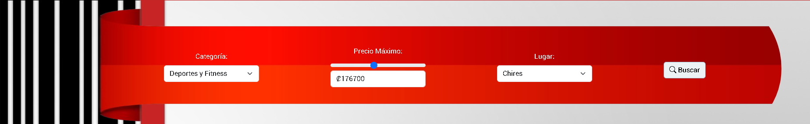
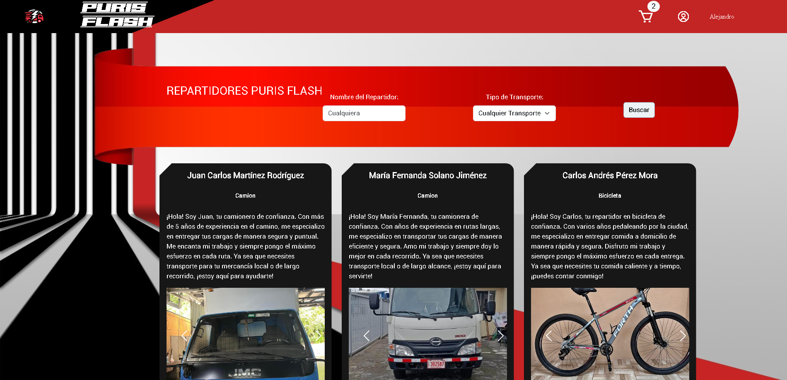
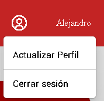

# 
**Universidad Latinoamericana de Ciencia y Tecnología**

**Proyecto Final**

**2CO24-166001G1 Servicios Web**

**Profesores:** Kattia Barrientos Arista / Jose Zuñiga Jimenez

**Integrantes:**
- Kevin Paniagua Sanchez
- Daniel Rodriguez Lobo
- Emiliano Steinvorth Pinto
- Alejandro Villalobos Cerdas

---

# Sistema de Productos PurisFlash

### Problemática:

Puriscal se ve afectado por varios desafíos como por ejemplo:

- Falta de servicios de entrega
- Distancias y accesibilidad
- Costumbre
- Ausencia de grandes franquicias

### Expectativas:

El objetivo que tenemos con este proyecto es poder darle un servicio esencial y que es bastante demandado a la población de Puriscal. Entendemos que estos servicios de entrega o "express" son bastante utilizados en la actualidad, y creemos que este proyecto puede ser una herramienta de gran valor para cumplir con esta necesidad.

### Tipo de usuarios:

Nuestro proyecto cuenta con dos tipos de usuarios:

- **Administrador**: Se encarga de manejar los productos de la página, los repartidores de nuestro servicio, y los usuarios que están registrados en la página.

- **Cliente**: El que puede adquirir los productos que sean necesitados para el mismo. De la misma forma, puede comunicarse con los repartidores por medio de "WhatsApp".

### Tecnologías utilizadas:

Se sabe que **MVC** es un modelo de diseño que se utiliza para desacoplar la interfaz (vista), los datos (modelo) y la lógica de la aplicación (controlador). Las solicitudes se enrutan a un controlador el cual se encarga de trabajar con el modelo para poder recuperar datos o hacer acciones. El controlador elige la vista que quiere que se muestre y le da el modelo. Al final, la vista representa el resultado final de la página, en función de los datos del modelo. A la hora de utilizar **ASP.NET**, este ofrece una forma eficaz en crear sitios web utilizando el patrón MVC, lo cual permite que se organice de mejor manera el proyecto. Utilizar ASP.NET permite utilizar varios motores de base de datos, como por ejemplo:

- SQLite
- SQL Server (se está utilizando para el proyecto)
- MySQL
- DB2

Al utilizar vistas con Razor, esto proporciona una manera sencilla de representar contenido HTML en cuanto a la vista. Utilizando Razor, se puede representar una página por medio de C#.

### Funcionamiento SQL Server con MVC:

A la hora de utilizar SQL Server con nuestro proyecto (ASP.NET MVC), la base de datos es como la "capa de datos" del proyecto, y se integra de la siguiente manera:

**Modelo:** Representa la estructura de datos en la aplicación. Utilizando clases de C#, estas se encargan de mostrar las tablas en la base de datos. Se puede utilizar tanto *Entity Framework*, como *ORM* para mapear las tablas de SQL Server a las clases de la aplicación. Al usar *Entity Framework*, se puede crear una clase de contexto de datos la cual maneja las conexiones a la base de datos.

**Controlador:** Manejan la lógica de la aplicación. Se encargar de recibir las acciones o peticiones del usuario, e interactuan con el modelo (base de datos) ya sea para obtener o manejar los datos, y también decide que vista mostrarle al usuario. Usualmente cada acción en un controlador se asocia a una operación CRUD (Crear, Leer, Actualizar, Eliminar), es decir, una acción puede consultarle los datos a la base de datos y en base a eso, le devuelve los datos a una vista.

**Vista:** Se encarga de presentarle los datos a los usuarios. Usualmente las vistas en MVC son archivos *.cshtml* los cuales combinan HTML con Razor para poder generar una interfaz de usuario dinámica. Los datos que se obtienen del controlador pasan a la vista, donde se convierten en formato HTML para que se le presenten así al usuario.

#### Interacción con base de datos:

Cuando alguna acción del controlador ocupa acceder a la base de datos, llama a los métodos en el contexto de datos para poder hacer consultas o actualizaciones. Este contexto de datos traduce las operaciones a comandos SQL los cuales se ejecutan en la base de datos. En caso de que hayan resultados, se devuelven al controlador, y después pasa los datos a la vista para que se puedan presentar.

La base de datos cuenta con una pasarela de pagos, la cual se encarga de que, a la hora de "realizar un pago" en la página, que haya un proceso en el que el usuario ingrese los datos de una tarjeta, y que a la hora de que se realice el pago, se le indique al usuario que su pago fue realizado con éxito. Mientras esto sucede, la base de datos está conectada con la cantidad de productos restantes, por lo que, a la hora de que se haga un pago, se elimina cierta cantidad de productos de la base de datos (dependiendo de la compra realizada por el usuario).  
De igual manera se cuenta con un sistema que administra los repartidores y los usuarios en el sistema. En cuanto a los repartidores, la base de datos almacena el tipo de transporte, una breve descripción de los repartidores, los números de teléfono, los nombres, y varias imágenes de los transportes respectivos de los repartidores. A la hora de agregar o eliminar repartidores en la aplicación (como administrador), la base de datos se actualizará según los cambios que se realicen.

En cuanto a los usuarios, la base de datos se encarga de almacenar la cédula, el nombre, los apellidos, la edad, el teléfono, los correos, el género, la dirección, el tipo de usuario (1 si es admin, 2 si es usuario regular) y por último la contraseña. Al crear un usuario en la aplicación, este se guarda en la base de datos, lo cual permite que se pueda acceder al sistema. También se pueden eliminar usuarios o modificar los datos según la necesidad del usuario, y estos cambios se verán reflejados en la base de datos.

### Funcionamiento de la aplicación:

#### 1. Inicio de sesión / Registro:

**1.1.** Al ingresar a la aplicación, contamos con la página de inicio de sesión, en la que se pueden ingresar los datos (cédula y contraseña) para poder acceder al sistema.

**1.2.** En caso de no tener un usuario registrado en el sistema, se puede ingresar a la página de registro presionando el botón de "Crear cuenta".

**1.3.** En la página de "Crear cuenta" se deben de ingresar los valores solicitados, como cédula, nombre, etc. Al rellenar todos los espacios, darle click al botón de "Crear Cuenta", y de esta manera, se puede ingresar al sistema.

#### 2. Página de productos:

**2.1.** Después de haber realizado el inicio de sesión, se puede observar la página "principal" del sitio web donde se pueden encontrar los productos disponibles, junto con sus precios respectivos, imágenes y cantidad de productos disponibles.

**2.2.** Cada producto cuenta con un botón de "Ver más", en el cual al presionarlo, nos lleva a una descripción más detallada del producto seleccionado. Podemos observar la descripción, el precio y la categoría en la que los productos pertenecen.

En caso de que un producto estuviese agotado, se le indicará al usuario que el mismo no está disponible. Se podrá acceder al producto, pero no se podrá agregar al carrito.

**2.3. Filtro de categoría:**  En la página donde podemos ver los productos, hay un cuadro en el que podemos elegir ver los productos según su categoría. De igual manera, podemos filtrar los productos según su precio máximo y el lugar en el que se venden los mismos. Al elegir los filtros y darle al botón "Buscar", se deberían de ver solo los productos que cumplan con los criterios del filtro.

#### 3. Página de Repartidores: 

En la página principal donde se pueden observar todos los productos, se puede ver un botón que dice "Repartidores".

Al presionar este botón, podemos ver todos los repartidores disponibles en nuestro sitio web, tanto sus nombres como el tipo de transporte que manejan los mismos. Igualmente, podemos observar un botón de "WhatsApp" debajo de cada repartidor, esto por si un cliente quiere comunicarse con su repartidor encargado de la entrega de su producto.

Al igual que con la página de productos, contamos con un filtro en el cual podemos buscar el nombre del repartidor que queramos al igual que el tipo de transporte, esto para poder ver solo los conductores con cierto nombre, y su respectivo vehículo.

#### 4. Carrito:

En todas las páginas, se puede acceder al carrito en la parte superior derecha de la página, el cual cuenta con un número que va indicando la cantidad de productos que están el el mismo.

En la página del carrito podemos ver los productos que hemos seleccionado anteriormente, junto con la cantidad seleccionada y el precio unitario. También podemos observar el precio total de todos los productos seleccionados. Igualmente se puede ver el nombre del repartidor asignado, junto con su vehículo respectivo, esto dependiendo de la cantidad de productos ordenados por el cliente.

En caso de querer quitar un producto del carrito, contamos con un botón "Quitar".

Al estar seguro de los productos que se quieren adquirir, presionar el botón de "Comprar".

#### 5. Comprar producto:

Para finalizar la compra de los productos que se quieran adquirir, insertar la información de la tarjeta como el número, el nombre, la fecha de expiración y el CVV. Para finalizar presionar el botón de "Pagar".

Al presionar el botón de "Pagar", saldrá un anuncio de "Procesando pago", y seguido de esto, se mostrará que el pago fue exitoso.

Al realizar el pago de un producto, se regresará al menú principal, donde se podrá observar que la cantidad de productos (según los productos adquiridos) fueron actualizados.

#### 6. Perfil:

Al presionar el ícono de la persona (ubicado al lado del ícono del carrito), se podrán observar dos opciones: "Actualizar perfil" y "Cerrar sesión".

**Actualizar perfil:** En esta parte podemos actualizar los datos de nuestro usuario, al finalizar, darle al botón de "Actualizar".

**Cerrar sesión:** Al presionar este botón, se cerrará la sesión y volveremos a la página de inicio de sesión.
